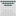

# BoGaLa (Board Game Language)

Bogala lets you create board game position diagrams using text and code. It's
inspired by tools like graphviz and mermaid.

Take a look at the [examples directory](./examples).

 

The codebase isn't in great shape, but it does work.
Better to share something than nothing!

## Usage

Browser: (Currently broken)

1. ~Start a webserver in this dir (required because ES6)~
2. ~Load up index.html via that webserver~

Node:

Currently bolted into the side of the asciidoc container so it can be used with
[asciidoctor-diagram][asciidoctor-diagram]. This is extremely hacky.

```sh
# Build docker image
docker build -t amfl/asciidoctor .

# Optionally mount the working dir into the container for ease of development
docker run -it -v $PWD:/tmpdir/ --workdir=/tmpdir --entrypoint=bash amfl/asciidoctor:latest

# Render some examples
node main-node.js examples/dameo.svg < examples/dameo.bogala
node main-node.js examples/onager.svg < examples/onager.bogala
```

## TODO

- [X] ES6 modules - Don't need any bundlers or nonsense https://david-gilbertson.medium.com/es6-modules-in-the-browser-are-they-ready-yet-715ca2c94d09
- [X] Make it work on node
- [X] Make it work in asciidoc
- [ ] Accept a line at a time, or handle areas
- [ ] Order stacks so there are no overlapping issues
- [ ] Errors/warnings
- [ ] Work in browser again with no changes

- [X] Square grids
- [ ] Stack placement on intersections
- Other language features:
  - [ ] Arrows
  - [ ] Lines
  - [ ] Letters
  - [ ] symbols
  - [ ] Piece facing
  - [ ] Chess pieces?

## Misc Notes

Could base it off sgf - http://dashstofsk.net/gorilla.html
http://dashstofsk.net/sgf.html Uses sgf to represent both go and hex boards, so
there's prior art for this.

Re: Running headless in node...

- https://newbedev.com/how-to-use-d3-in-node-js-properly
- Could use [svg.js][svg] instead of d3js: https://github.com/svgdotjs/svgdom
    - Official, node-friendly version of example visualization lib from
      honeycomb docs

I'd like to end up with something like
https://nestorgames.com/docs/YavalathCo2.pdf

See also:

- <https://www.hexwiki.net/index.php/New_board_diagrams>

[svg]: <https://svgjs.dev/docs/3.0/>
[asciidoctor-diagram]: <https://docs.asciidoctor.org/diagram-extension/latest/>
